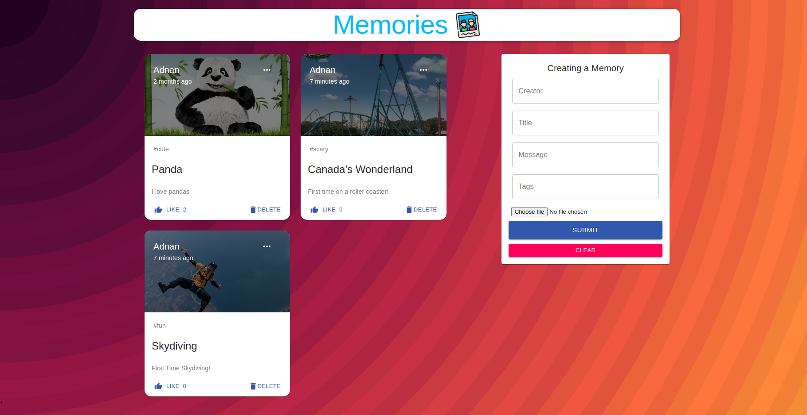

# Photo-Blog-App
An app where you can upload photos and add captions to each photo

This uses the MERN ( MongoDB, Express, Reaact, Node) stack to allow users to post about events in their lives. Users can add, delete, like and edit posts. 

## Demo ##

  

